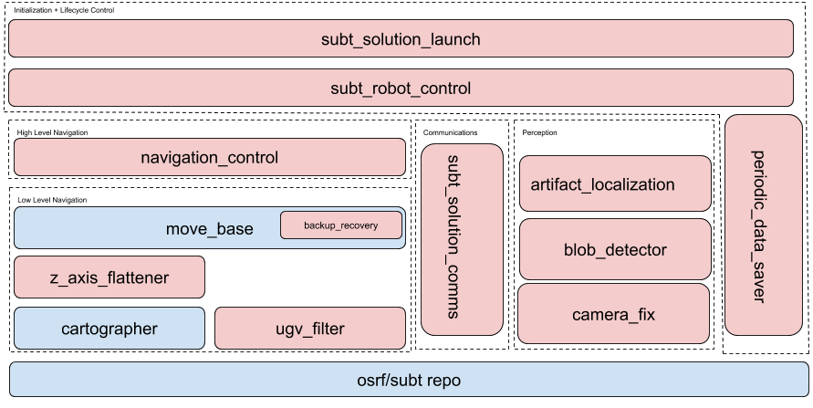

# SubT_Solution

This repository contains all of the code necessary to develop a working simulated robot for the [DARPA SubT Challenge](https://www.subtchallenge.com/) (virtual track).
With this repository, you should be able to enter a submission to the competition with one or more robots that will score at least one point.

The files in this repository are configured to be used in the `cave_qual` world with the following SubT robot platforms:
* [X2_SENSOR_CONFIG_6](https://github.com/osrf/subt/wiki/Robots#x2-small-skid-steer-ugv) - UGV
* [SSCI_X4_SENSOR_CONFIG_1](https://github.com/osrf/subt/wiki/Robots#ssci_x4-large-uav) - UAV

If you'd like to change the configurations to work for different robot platforms and/or different competition worlds, take a look at the parameters in the [package descriptions](#package-descriptions) section.
These parameters can be set in the solution launch files for UGVs ([robot.launch](./packages/subt_solution_launch/launch/robot.launch)) and UAVs ([uav_robot.launch](./packages/subt_solution_launch/launch/uav_robot.launch)).

## Table of Contents

* [Solution Overview](#solution-overview)
  - [Low Level Navigation](#low-level-navigation)
  - [High Level Navigation](#high-level-navigation)
  - [Communications](#communications)
  - [Perception](#perception)
  - [Initialization and Lifecycle Control](#initialization-and-lifecycle-control)
* [Package Descriptions](#package-descriptions)
  - [artifact_localization](#artifact_localization)
  - [artifact_localization_msgs](#artifact_localization_msgs)
  - [backup_recovery](#backup_recovery)
  - [blob_detection](#blob_detection)
  - [camera_fix](#camera_fix)
  - [navigation_control](#navigation_control)
  - [periodic_data_saver](#periodic_data_saver)
  - [subt_robot_control](#subt_robot_control)
  - [subt_solution_comms](#subt_solution_comms)
  - [subt_solution_launch](#subt_solution_launch)
  - [uav_filter](#uav_filter)
  - [uav_nav_msgs](#uav_nav_msgs)
  - [uav_navigation](#uav_navigation)
  - [ugv_filter](#ugv_filter)
  - [z_axis_flattener](#z_axis_flattener)
* [Usage](#usage)
  - [Local vs Docker Usage](#local-vs-docker-usage)
  - [Installation](#installation)
  - [Building](#building)
  - [Running](#running)
    - [UGV](#UGV)
    - [UAV](#UAV)
* [Visualizing The Results of a Cloudsim Submission](#visualizing-the-results-of-a-cloudsim-submission)
* [Known Issues and Areas for Improvement](#known-issues-and-areas-for-improvement)

## Solution Overview

To be successful in the SubT challenge, a SubT solution needs to perform a series of complex tasks.
The robots (UAVs and/or UGVs) must be capable of moving around a subterranean environment, which typically has rugged and uneven terrain.
Each robot must observe its surroundings, localize itself, and report [artifacts](https://www.subtchallenge.com/resources/SubT_Cave_Artifacts_Specification.pdf) of interest. The robots must also communicate and coordinate their actions with other robots in this environment; this is a challenging task since the environment does not allow for reliable communications.



*An outline of the components that make up the basic solution.
More details for each component are given below.*

### Low Level Navigation

This solution uses `cartographer` to localize a robot, and `move_base` to navigate the robot.
Since `move_base` is a 2d navigation component, we added a layer of filtering (`uav_filter` and `ugv_filter`) between `move_base` and the robot's lidar to allow for 3d navigation with `move_base`.
The filter layer filters pointcloud data based on the slope of the terrain, adding or removing obstacles based on the apparent slope.
There is also a UAV navigation framework (`uav_navigation`) that keeps the UAV at a level altitude over the terrain.
We also have an adaptation layer (`z_axis_flattener`) that adjusts the 3D transformations received from cartographer to remove the elevation component, and fixes the robot to a flat XY plane.

* [cartographer](https://github.com/cartographer-project/cartographer_ros)
* [move_base](http://wiki.ros.org/move_base)
* [uav_filter](#uav_filter)
* [uav_navigation](#uav_navigation)
* [ugv_filter](#ugv_filter)
* [z_axis_flattener](#z_axis_flattener)

### High Level Navigation

Once a robot is able to navigate the SubT terrain, it needs to know were to go.
To do that, the solution uses the `navigation_control` package.
This package has 3 main parts:

* `frontier_finder`
* `graph_controller`
* `motion_controller`

The `frontier_finder` takes in the current position of the robot along with its costmap to create a series of points at a given distance around the robot. These points are the frontier that the robot can explore. 
The `graph_controller` builds a graph of connected points representing where the robot has been or can try to go to.
The `motion_controller` is a wrapper around `move_base` services.
The graph can be modified to represent graphs received from other robots, creating a global history of explored, unexplored, and inaccessible places inside the subterranean environment.

* [navigation_control](#navigation_control)

### Communications

Communications between other robots and the base station are handled by the [SubT comms framework](https://github.com/osrf/subt/tree/master/subt-communication).
If a robot is within communication range, thit frameworks allows robots to send messages to each other and to the base station.
The `subt_solution_comms` package relays data between a robot's ROS node and the provided SubT communications framework.

* [subt_solution_comms](#subt_solution_comms)

### Perception

Robots need to accurately detect and localize artifacts in an environment in order to score points.
To do this, the `blob_detection` node processes data from the robot's camera, to find areas in the environment that have the same color as the artifacts. 
When blobs are found, the `artifact_localization` component positions the blobs in the proper frame and stores this data to report it to the `base_station` when possible.
There is also the `camera_fix` node, which fixes the camera frame's orientation from the ignition simulation side.

* [camera_fix](#camera_fix)
* [artifact_localization](#artifact_localization)
* [blob_detection](#blob_detection)

### Initialization and Lifecycle Control

There are a series of packages that are responsible for initializing and terminating the components of the solution.
`subt_solution_launch` contains launch files (`uav_robot.launch` and `robot.launch`) that launch all of the solution nodes with a given configuration.
`subt_robot_control` waits for the simulation to be properly started, builds and initializes the `graph_controller` node from the `navigation_control` package, and then commands the robot to explore when ready.
`subt_robot_control` also signals the robot to stop exploration if a termination criteria is met (for more information about this, take a look at the `subt_robot_control` package description).
The `periodic_data_saver` takes care of saving data in a way that can be examined after a simulation run has completed.

* [subt_solution_launch](#subt_solution_launch)
* [subt_robot_control](#subt_robot_control)
* [periodic_data_saver](#periodic_data_saver)

## Package Descriptions

### artifact_localization

This package contains the code needed to find the `artifact_origin` frame and locate a detected artifact in the `artifact_origin` frame.
Localization is done by calculating the centroid of the depth-based sensor data (either lidar or RGBD camera) that is in a detection's bounding box, and then transforming the location of this centroid into the `artifact_origin` frame.

This package also contains an [ArtifactDatabase](./packages/artifact_localization/include/artifact_localization/ArtifactDatabase.hh), which tracks which artifacts that have been detected.
If a robot has a new detection, the artifact database is checked to see if this detection matches a previously detected artifact.
If an artifact is detected, the location of the new detection is averaged with the previous detection locations to enhance the precision of the reported position.
When a new detection does not match anything in the database the detection is added to the database as a new artifact.

Since one robot may detect other robots as artifacts (for example, a red robot being mistaken for a backpack), artifact localization uses a [RobotPositionRadar](./packages/artifact_localization//include/artifact_localization/ExternalPointRadar.hh) to keep track of other robot's most recent locations.
If a robot has a detection that is within a certain distance of another known robot location (see the `~external_robot_tolerance` parameter), then this detection is interpreted as a false positive and is discarded.

Parameters:
* `~/artifact_origin_frame` (string, default: `artifact_origin`)
  The name of the `artifact_origin` frame.
* `~/base_link_frame` (string, default: `X1`)
  The name of the robot's `base_link` frame.
* `~/camera_frame` (string, default: `X1/base_link/camera_front`)
  The name of the robot's camera frame.
* `~/external_robot_tolerance` (float, default: `3.0`)
  How far away another robot and artifact must be to consider a detection as a false positive (this avoids saving other robot detections as artifacts).
* `~/map_frame` (string, default: `X1/map`)
  The name of the map frame.
* `~/name` (string, default: `X1`)
  The name of the robot.
* `~/object_frame` (string, default: `object_frame`)
  The name of the frame for object detections.

Subscription Topics:
* `artifact_report_result` (`std_msgs/String`)
  Contains a response from the base station for an artifact that has been reported.
  This data is used to mark unreported artifacts in the artifact database.
* `input/bounding_boxes` (`darknet_ros_msgs/BoundingBoxes`)
  Bounding box data for a detection.
* `input/camera_info` (`sensor_msgs/CameraInfo`)
  Camera information for the robot.
  Used to map a pixel's position to the position in a detection.
* `input/point_cloud` (`sensor_msgs/PointCloud2`)
  Incoming point cloud data that is  is used to calculate the centroid of a bounding box.
* `other_robot_pose` (`std_msgs/String`)
  Other robot locations, serialized as a string.
  This is used when checking if a detection is a false positive or not (take a look at the `~external_robot_tolerance` parameter above).

Publication Topics:
* `cropped_pc` (`sensor_msgs/PointCloud2`)
  The point cloud data that is within a detection's bounding box.
  Useful for debugging.
* `detected_artifacts` (`std_msgs/String`)
  A serialized message containing detected artifact information.
  This is used by the [CommsManager](./packages/subt_solution_comms/include/subt_solution_comms/comms_manager.hh) to report artifacts to the base station for scoring.
* `output/num_detected_artifacts` (`std_msgs/UInt32`)
  The current number of artifacts detected by a robot.
  Useful for debugging.
* `output/unreported_artifacts` (`std_msgs/UInt32`)
  The current number of unreported artifacts in a robot's artifact database.
  Useful for debugging.

Services:
* `~report_artifacts` (`artifact_localization_msgs/ReportArtifacts`)
  Used to report found artifacts to the base station.

### artifact_localization_msgs

This package defines a service ([artifact_localization_msgs/ReportArtifacts](./packages/artifact_localization_msgs/srv/ReportArtifacts.srv)) that can be used to report artifacts.

The service request and response are both of type `std_msgs/Empty`.
The client for this service is used in `subt_robot_control`'s [Controller](./packages/subt_robot_control/include/subt_robot_control/controller.hh), while the server source code can be found in `artifact_localization`'s [ArtifactReporter](./packages/artifact_localization/include/artifact_localization/ArtifactReporter.hh).

### backup_recovery

The `backup_recovery::BackupRecovery` is a simple recovery behavior that attempts to back the robot away from any obstacles in the costmap.
It adheres to the `nav_core::RecoveryBehavior` interface found in the `nav_core` package and can be used as a recovery behavior plugin for the `move_base` node.

Additionally, it will check the local costmap against the robot footprint to see if there are any potential collisions.

Parameters:

* `~<name>/backwards_vel` (`double`, default: `-0.3`)
    Velocity to apply while backing up.

* `~<name>/backup_dist` (`double`, default: `0.5`)
    Distance to attempt to back up.

* `~<name>/freq` (`double`, default: `20.0`)
    The rate in which progress is checked

An example on how to use the plugin can be found in the [`move_base` configuration](packages/subt_solution_launch/config/move_base/planner.yaml).

### blob_detection

The `blob_detection::BlobDetector` is a ROS node that listens to an image topic, checks whether there are big regions of a particular color, draws a bounding box around those zones, and publishes that bounding box into another topic.
It also has a debugging topic, where it publishes the original image, with the bounding boxes drawn on top.
The algorithm is roughl based on  OpenCV's [SimpleBlobDetector](https://docs.opencv.org/3.4/d0/d7a/classcv_1_1SimpleBlobDetector.html).

It supports adding extra colors just by determining the max and min HSV threshold.
You can get those by following OpenCV's [range guide](https://docs.opencv.org/3.4/da/d97/tutorial_threshold_inRange.html).

Subscription Topics:
* `input/image_raw` (`sensor_msgs/Image`)
    Source image from where to filter the colors

Publication Topics:
* `output/bounding_boxes` (`darknet_ros_msgs/BoundingBoxes`)
    Bounding box for the detected blobs, if any

* `output/debug_image` (`sensor_msgs/Image`)
    Source image with bounding boxes drawn on top of it

More information about `darknet_ros_msgs` can be found [here](https://github.com/leggedrobotics/darknet_ros/tree/master/darknet_ros_msgs).
Each bounding box is just two points representing oposite corners of a rectangle, which makes this stack easily exchangeable with any CNN based approach.

### camera_fix

The `camera_fix::FixingNode` is a ROS node that fixes transformation differences between Gazebo's and ROS's image conventions.
Gazebo uses X as the lens's orientation axis (optical axis), and ROS (and all the other robot applications) use Z as the lens's orientation axis (optical axis).

Note that this node is not necessary anymore, as recent `subt-virtual-testbed` updates [fixed this issue](https://github.com/osrf/subt/pull/413) on Ignition's side.

Parameters:

* `~/new_frame_id` (`string`, default: `/base_link/camera_frame`)
    The new frame id the node is going to set the new messages to.

Subscription Topics:

* `input/image_raw` (`sensor_msgs/Image`)
    Input Image message to have its orientation fixed.

* `input/camera_info` (`sensor_msgs/CameraInfo`)
    Input CameraInfo message to have its orientation fixed.

Publication Topics:

* `output/image_raw` (`sensor_msgs/Image`)
    Output Image message with its orientation fixed.

* `output/camera_info` (`sensor_msgs/CameraInfo`)
    Output CameraInfo message with its orientation fixed.

This node works in conjunction with a `tf/static_transform_publisher` as shown in [this launch file](./packages/camera_fix/launch/camera_tf_fix.launch).
This static publisher is the one that creates the new frame `camera_fix` uses to set up the new messages.

### navigation_control

The `navigation_control` package includes a library for high-level planning used in exploration and backtracking.

The package is centered around a graph data structure that keeps track of the regions that has been visited as well as potential locations to explore next.
As the robot moves through the cave, the `frontier_finder` locates potential paths of exploration, and the `graph_controller` selects the next best locations to visit based on a variety of heuristics.
These locations are then converted to a queue of graph nodes, which are fed to the `navigation_control` component.
`Navigation_control` handles navigating the robot to a new location by guiding it through the nodes on the queue.

This package has functionality for serializing the graph data structure to be shared with other platforms.
The graph data structure supports merging multiple graphs together into a single representation of the environment.

There are several main components of the `navigation_control` package:

* [graph_controller::Graph](./packages/navigation_control/include/graph_controller/graph.hh) - central graph data structure. Contains functionality for adding nodes, computing scores, merging, and visualization.
* [graph_controller::Node](./packages/navigation_control/include/graph_controller/node.hh) - single entry in the graph data structure.
* [graph_controller::Serializer](./packages/navigation_control/include/graph_controller/serializer.hh) - serializes and deserializes the graph to a communications-compliant string.
* [graph_controller::Controller](./packages/navigation_control/include/graph_controller/controller.hh) - high-level controller that controls the exploration state of the robot.
* [navigation_control::MotionController](./packages/navigation_control/include/navigation_control/motion_controller.hh) - provides the interface between the `graph_controller::Controller` and `move_base` APIs.
* [frontier_finder::FrontierFinder](./packages/navigation_control/include/frontier_finder/frontier_finder.hh) - computes "frontiers" or avenues of potential exploration to be added to the graph.

Parameters:

* `~/wait_seconds_before_exploring` (`float`, default: `0.0`)
    Time to wait before starting to explore.
    Useful when you have multiple robots, so that they enter the cave at different times.

* `~/distance_until_merge` (`float`, default: `30.0`)
    How far away the robot should be from the `artifact_origin` before starting to merge graphs received from other robots.

* `~/starting_node_x_pos` (`float`, default: `5.0`)
    The x position for the starting node of the graph, in relation to the `artifact_origin` frame.
    The starting node defines where the robot starts exploring from.

* `~/starting_node_y_pos` (`float`, default: `0.0`)
    The y position for the starting node of the graph, in relation to the `artifact_origin` frame.
    The starting node defines where the robot starts exploring from.

* `~/debug` (`bool`, default: `false`)
    When true, publishes information that can be visualized on rviz.

* `~/path_distance` (`float`, default: `5.0`)
    When searching for new frontiers, the edge of a circle with a radius of `path_distance` is scanned for new traversable space.
    Although the graph is expanded incrementally at a distance of `path_distance`, nodes aren't always necessarily `path_distance` apart due to changes in orientation.

* `~/lock_percentage` (`float`, default: `0.7`)
    Percentage of `~/path_distance`.
    When adding a new node, if the distance to any old node is less than `lock_percentage * path_distance`, the new node will be considered the old node instead of being added.

### periodic_data_saver

The `periodic_data_saver` package includes a single node for saving snapshots of large data messages from a simulation run.

This is useful because the SubT cloudsim submissions are only allowed to record a relatively small amount of data based on the [API Documentation](https://github.com/osrf/subt/wiki/api#custom-data-logging).
The data_saver node works around this by only periodically saving these high-bandwidth topics (defaults at 300 seconds).

Parameters:

* `~/map_topic_original` (`string`, default: `map`)
  The original topic that is receiving map messages.
* `~/trajectory_topic_original` (`string`, default: `trajectory_node_list`)
  The original topic that is receiving trajectory_list messages.
* `~/save_rate` (`int`, default: `300`)
  How frequently (in seconds) the topics will be polled and saved
* `~/map_topic_logging` (`string`, default: `/robot_data/map`)
  The downsampled map topic
* `~/trajectory_topic_logging` (`string`, default: `/robot_data/trajectory_list`)
  The downsampled trajectory_list topic

### subt_robot_control

The `subt_robot_control` package provides a node that handles the life cycle of a robot in the competition.
It calls the provided SubT service to start the competition.
Once the competition has started, the node triggers the robot exploration behavior.
This node terminates exploration whenever one of the following events occur:
1. Battery life of a robot falls below a certain percentage
2. The robot has run out of places to explore
3. A certain amount of time has passed in the simulation run

Parameters:

* `~/artifact_origin_frame` (`string`, default: `artifact_origin`)
  Frame of the artifact_origin transform.

* `~/map_frame` (`string`, default: `map`)
  The map's frame.

* `~/has_odom` (`bool`, default: `true`)
  If the robot is expected to publish an odometry message. UGVs have odom and UAVS don't.

* `~/min_battery_percentage` (`float`, default: `0.35`)
  Minimum battery level percentage required to explore.
  If the battery percentage goes below this value, stop exploring and start the backtrack routine.

* `~/robot_name` (`name`, default: `X1`)
  The robot's name.

Subscription Topics:

* `local_robot_pose` (`std_msgs/String`)
  Publishes a string representing a serialized `ignition::msgs::Pose` with the current pose of the robot.

Publication Topics:

* `battery_state` (`sensor_msgs/BatteryState`)
  Gets the current battery state.

Services:

* `report_artifacts` (`artifact_localization_msgs/ReportArtifacts`)
  Used to report found artifacts to the base station.

### subt_solution_comms

The `comms_manager` is a node that relays messages between ROS topics and the `subt communications framework`.
It allows for robots to communicate with other robots and the SubT base station.

Parameters:

* `~/graph_port` (`int`, default: `5000`)
  SubT comms port for other robot graph updates.

* `~/pose_port` (`int`, default: `5001`)
  SubT comms port for other robot pose updates.

* `~/robot_name` (`name`, default: `X1`)
  Robot's name.

Subscription Topics:

* `detected_artifacts` (`std_msgs/String`)
  Detected artifacts from `artifact_localization`.
  This information is sent to the base station through the SubT communications framework.

* `local_robot_graph` (`std_msgs/String`)
  This robot's navigation graph.
  Forwarded to other robots through the SubT communications framework.

* `local_robot_pose` (`std_msgs/String`)
  This robot's pose.
  Forwarded to other robots through the SubT communications framework.

Publication Topics:

* `artifact_report_result` (`std_msgs/String`)
  Artifact report results received from the SubT base station.

* `other_robot_graph` (`std_msgs/String`)
  Serialized graphs received from other robots.

* `other_robot_pose` (`std_msgs/String`)
  Poses received from other robots.

### subt_solution_launch

This package contains the "meta" launch files needed to use a robot in the SubT competition.
[robot.launch](./packages/subt_solution_launch/launch/robot.launch) can be used to start a UGV, and [uav_robot.launch](./packages/subt_solution_launch/launch/uav_robot.launch) can be used to start a UAV.
These two launch files incorporate a mixture of the other packages in this repository to perform autonomous exploration for a robot with communication and perception capabilities.

It is recommended to use `X2_SENSOR_CONFIG_6` with `robot.launch`, and `SSCI_X4_SENSOR_CONFIG_1` with `uav_robot.launch`.
Please refer to the [usage - running](#running) section for example usage of these launch files.

### uav_filter

The `uav_filter::UAVFilter` is a ROS node that filters the 3D pointcloud, deleting the points inside of it that are too close to the origin (probably points generated by parts of the robot) and the points that are far bellow the flying UAV.

For deleting the points that are too close, it defines a box containing the robot (size of the box calculated from robot's `urdf`) and deletes the points inside of that box.

For deleting the points that are far bellow the UAV, it transforms the pointcloud to a global frame (so z axis = height) and then deletes all the point with a z of less than 0.

Parameters:

* `~/x_max` (`double`, default: `0.45`)
    Max x value of the box containing the robot.

* `~/x_min` (`double`, default: `-0.45`)
    Min x value of the box containing the robot.

* `~/y_max` (`double`, default: `0.45`)
    Max y value of the box containing the robot.

* `~/y_min` (`double`, default: `-0.45`)
    Min y value of the box containing the robot.

* `~/z_max` (`double`, default: `0.3`)
    Max z value of the box containing the robot.

* `~/z_min` (`double`, default: `-0.3`)
    Min z value of the box containing the robot.

Subscription Topics:

* `input` (`sensor_msgs/PointCloud2`)
    Pointcloud to filter.

Publication Topics:

* `output` (`sensor_msgs/PointCloud2`)
    Output of the filter.

### uav_nav_msgs

This package contains a [uav_nav_msgs/ResetStatus](./packages/uav_nav_msgs/msg/ResetStatus.msg) message type that is used by the `uav_navigation` package.
This message lets the `uav_navigation/CmdVelFilter` know if the UAV is performing a hard vertical reset or not (for more information about a hard vertical reset, take a look at the `uav_navigation` documentation).

### uav_navigation

This package handles autonomous UAV navigation by using a [FlightController](./packages/uav_navigation/include/uav_navigation/FlightController.hh) that keeps the UAV at a certain distance above the ground (see the `~hoverHeight` param below).
In order for the UAV to maintain a certain distance above the ground while traveling horizontally, a [CmdVelFilter](./packages/uav_navigation/include/uav_navigation/CmdVelFilter.hh) is used.
The `CmdVelFilter` merges time-synchronized velocities from `move_base` (`x` and `y` components) and the `FlightController` (`z` component), which allows the UAV to achieve horizontal travel while maintaining a specific height above the ground.
If the UAV gets too close to the ceiling or floor of a SubT environment (see the `~minLidarDist` parameter), a _hard vertical reset_ occurs.
A hard vertical reset means that the `CmdVelFilter` ignores translational command velocities from `move_base`, and only applies the `FlightController`'s vertical command velocities at a magnitude of `~resetVerticalVel` until the UAV's height above the ground is `~hoverHeight`.
A hard vertical reset is a safety feature that may happen when a SubT environment has a drastic vertical shift (for example, a straight up/down vertical chute).

In order for the `FlightController` to work correctly, a UAV with upward and downward facing point lidars must be used - for example, [SSCI_X4_SENSOR_CONFIG_1](https://github.com/osrf/subt/wiki/Robots#ssci_x4-large-uav).

Parameters:

* `~hoverHeight` (`double`, default: `0.55`)
  The height (in meters) above the ground the UAV should fly at.
* `~hoverTolerance` (`double`, default: `.02`)
  The tolerance (in meters) given to the UAV when trying to maintain a height of `~hoverHeight` above the ground.
  If the UAV's height above the ground falls outside of [`~hoverHeight - ~hoverTolerance` , `~hoverHeight + ~hoverTolerance`], then the UAV will apply `~maintainVerticalVel` to raise/lower the UAV back into the [`~hoverHeight - ~hoverTolerance` , `~hoverHeight + ~hoverTolerance`] range.
* `~maintainVerticalVel` (`double`, default: `0.1`)
  The vertical command velocity to be applied by the flight controller when keeping the UAV at a certain height above the ground.
* `~minLidarDist` (`double`, default: `0.25`)
  The minimum value the UAV's top or bottom point lidar can read before the robot does a hard vertical reset.
* `~resetVerticalVel` (`double`, default: `0.4`)
  The vertical command velocity to be applied by the flight controller when performing a hard vertical reset.

Subscription Topics:

* `top_scan` (`sensor_msgs/LaserScan`)
  Data from the upward-facing point lidar.
* `bottom_scan` (`sensor_msgs/LaserScan`)
  Data from the downward-facing point lidar.

Publication Topics:

* `controller_cmd_vel` (`geometry_msgs/Twist`)
  Command velocities that help the UAV hover.
* `reset_state_status` (`uav_navigation_msgs/ResetStatusMsg`)
  Whether the `FlightController` is in the `kReset` state or not.
  This lets the `CmdVelFilter` know if `move_base` translational velocities should be ignored.

### ugv_filter

The `ugv_filter::UGVFilter` is a node that filters a `sensor_msgs/PointCloud2` message based on the slopes between the points, following its azimuth angles.
The calculations used here were made using [this paper](https://arxiv.org/pdf/1603.00912.pdf) as inspiration.

It has a non-delete mode, which allows the user to "flatten" the points instead of filtering them out, but tests using the non-delete approach were inconclusive.

Parameters:

* `~/name` (`string`, default: `X1`)
    Namespace used for this robot

* `~/slope` (`double`, default: `45`)
    Angle (in degrees) used to filter the points. Any point with a slope lower than this value is deleted.

* `~/delete` (`bool`, default: `true`)
    If true, the points filtered are deleted. Else, the points are flattened.

* `~/flat_frame` (`string`, default: `odom`)
    If delete is false, frame to flatten the points relative to.

* `~/flat_height` (`double`, default: `-0.25`)
    If delete is false, distance from z = 0 to flatten to.

Subscription Topics:

* `input` (`sensor_msgs/PointCloud2`)
    The PointCloud2 message to filter

Publication Topics:

* `output` (`sensor_msgs/PointCloud2`)
    PointCloud2 after the filtering

### z_axis_flattener

The `z_axis_flattener::ZAxisFlattener` is a ROS node that allows for the usage of [move_base](http://wiki.ros.org/move_base) in a 3D world.
It publishes a new base_link frame (see the `~new_frame` parameter below) that is always in the same plane as the `move_base` costmaps.
This new frame is calculated by removing the roll and pitch of the robot's most recent base_link frame, and then setting the height of this frame to the height of the costmap frame.
This new frame properly aligns the robot and its sensor data with `move_base`'s costmaps so that obstacles are generated correctly.
This new frame had to be created since we are using a 2D navigation package (`move_base`) in a 3D world.

Parameters:

* `~/flat_frame` (`string`, default: `map`)
    Origin frame you want to maintain transformations with.

* `~/name` (`string`, default: `X1`)
    Namespace of this node.

* `~/new_name` (`string`, default: `fake`)
    Name of the new frame published.

## Usage

### Local vs Docker Usage

The solution can be used on your machine locally, or through a provided Docker image.
If you'd like to use Docker, take a look at the [`docker`](./docker/) directory for instructions.
Otherwise, read the instructions below for local installation and usage.

(Keep in mind that some of the paths in the instructions below may vary slightly for a local setup vs a Docker setup).

### Installation

*First, make sure you meet the [system requirements](https://github.com/osrf/subt/wiki/System%20Requirements).
Then, follow steps 1 and 2 from the [`osrf/subt` catkin system step guide](https://github.com/osrf/subt/wiki/Catkin%20System%20Setup) to download all `osrf/subt` dependencies.*

Create a workspace and download supporting repositories.

```
# Create solution workspace dir
mkdir ~/subt_solution_ws

# Create source dir
mkdir ~/subt_solution_ws/src

# Get rosinstall repos
cd ~/subt_solution_ws
wget https://raw.githubusercontent.com/osrf/subt_solution/master/solution.repos?token=ADJTSVAIIBQX6BZ6MAP44NK6VG5OW

# Clone necessary code
vcs import src --recursive < solution.repos

# install dependencies:
source /opt/ros/melodic/setup.bash
cd ~/subt_solution_ws
rosdep install --from-paths src --ignore-src -r -y --skip-keys="ignition-common3 ignition-msgs4"
```

### Building

*If you decide to build with `colcon` instead of `catkin_make`, be sure to [install colcon](https://colcon.readthedocs.io/en/released/user/installation.html) first.*

```
cd ~/subt_solution_ws

# Source ROS melodic
source /opt/ros/melodic/setup.bash

# Using catkin_make
catkin_make install

# OR using colcon (if you don't want to use catkin_make)
colcon build
```

### Running

#### UGV

```
# launch a subt simulation environment using a UGV
source ~/subt_solution_ws/install/setup.bash
ign launch -v 4 cave_circuit.ign worldName:=cave_qual robotName1:=X1 robotConfig1:=X2_SENSOR_CONFIG_6

# start the UGV autonomy stack
source ~/subt_solution_ws/install/setup.bash
roslaunch subt_solution_launch robot.launch name:=X1

# rviz for visualization
source /opt/ros/melodic/setup.bash
rviz -d ~/workspaces/solution_ws/src/subt_solution/subt_solution_launch/config/rviz/rviz.config.rviz

# if the above command for rviz doesn't work, you can try this:
source /opt/ros/melodic/setup.bash
rosrun rviz rviz -d ~/workspaces/solution_ws/src/subt_solution/subt_solution_launch/config/rviz/rviz.config.rviz
```

#### UAV

```
# launch a subt simulation environment using a UAV
source ~/subt_solution_ws/install/setup.bash
ign launch -v 4 cave_circuit.ign worldName:=cave_qual robotName1:=X1 robotConfig1:=SSCI_X4_SENSOR_CONFIG_1

# start the UAV autonomy stack
source ~/subt_solution_ws/install/setup.bash
roslaunch subt_solution_launch uav_robot.launch name:=X1

# rviz for visualization
source /opt/ros/melodic/setup.bash
rviz -d ~/workspaces/solution_ws/src/subt_solution/subt_solution_launch/config/rviz/rviz.config.rviz

# if the above command for rviz doesn't work, you can try this:
source /opt/ros/melodic/setup.bash
rosrun rviz rviz -d ~/workspaces/solution_ws/src/subt_solution/subt_solution_launch/config/rviz/rviz.config.rviz
```

## Visualizing The Results of a Cloudsim Submission

When submitting a solution to the competition through [Cloudsim](https://github.com/osrf/subt/wiki/Cloudsim), it's useful to debug your submission if the results from Cloudsim aren't what you expected.

For each robot submitted, there will be a corresponding data download which includes the `rosbag` file of topics in the `/robot_data` namespace.
For more information on this, consult the [Custom Data Logging API](https://github.com/osrf/subt/wiki/api#custom-data-logging).

In the case that the simulation terminates before the bag file was completely closed, it may be necessary to reindex the bag, which rebuilds necessary metadata.
This will be indicated if the data file ends with `.bag.active` rather than `.bag`.

```
source /opt/ros/melodic/setup.bash
rosbag reindex FILE_TO_REINDEX.bag
```

Next, go ahead and start rviz so that you can visualize the simulation results (you'll need to start `roscore` in order to do this).
There's an rviz configuration in this repository that supports up to 4 robots (named `X1`, `X2`, `X3`, and `X4`):

```
# start roscore in one terminal
source /opt/ros/melodic/setup.bash
roscore

# start rviz in another terminal
source /opt/ros/melodic/setup.bash
rviz -d ~/subt_solution_ws/src/subt_solution_launch/config/rviz/ROBOT_DATA.rviz
```

In order to view a robot's data correctly, you need the transform between the `map` and `artifact_origin` frame.
You can run `robot.launch` (or `uav_robot.launch`) locally until this transform is published for the robot you are trying to visualize (you can shut down the launch file and the simulator once the robot starts moving):

```
# start a simulator in the appropriate world with the correct robot in one terminal

# run robot.launch or uav_robot.launch in another terminal temporarily until the transform between map and artifact_origin has been published
source ~/subt_solution_ws/install/setup.bash
roslaunch subt_solution_launch robot.launch name:=<NAME_OF_ROBOT>
```

After reindexing and setting up the submission visualization, we recommend playing all of the `rosbag` files together at a faster rate (i.e., 5-10 times the speed).
You'll need one terminal for each robot, so, supposing 4 robots (named `X1`, `X2`, `X3`, and `X4`):

```
source /opt/ros/melodic/setup.bash
rosbag play ROBOT_1_FILE.bag -r 10 -p /X1/

source /opt/ros/melodic/setup.bash
rosbag play ROBOT_2_FILE.bag -r 10 -p /X2/

source /opt/ros/melodic/setup.bash
rosbag play ROBOT_3_FILE.bag -r 10 -p /X3/

source /opt/ros/melodic/setup.bash
rosbag play ROBOT_4_FILE.bag -r 10 -p /X4/
```

## Known Issues and Areas for Improvement

Since this solution provides basic functionality for solving the SubT challenge, there are various limitations when using this solution.
Here is a list of areas that can be improved by external users who are using this solution as a starting point:
1. The blob detector [cannot detect helmets](./packages/blob_detection/src/blob_detection.cc#L158).
2. Each robot has an [artifact database](./packages/artifact_localization/include/artifact_localization/ArtifactDatabase.hh), but does not have a way of sharing this artifact database with other robots.
A potential improvement would be for robots to share artifact databases with one another so that robots don't spend time detecting or reporting artifacts that another robot has already dealt with.
3. The `periodic_data_saver` package saves duplicate map data. When replaying/visualizing the map data saved by the `periodic_data_saver` node, only the first map message that was saved appears in `RViz`, even if multiple map messages were saved.
4. The blob detector localizes a detected object by calculating the centroid of the lidar points in a pyramid, with the base of the pyramid being the bounding box of the detection, and the tip of the pyramid being the origin of the robot's camera frame.
If the the edges of the bounding box aren't completely sealed by the localized object, and there's a significant amount of free space between the detected object and the closest object behind it. In this case, he blob detector will include these deeper points as a part of the centroid calculation.
Since these deeper points are considered "outliers" (they aren't correlated with the detected object), using them in the centroid calculation may lead to inaccurate localization of the object.
5. This solution uses a simple mechanism (a "starting node") to point the robot towards the entrance of a subterranean world, but this mechanism doesn't always guarantee that the robot will enter the world and start exploring it.
Since each subterranean world has a different geometry, there may be cases where the robot will explore the staging area instead of entering and exploring the subterranean world (for more information about how to guide a robot into different subterranean worlds, take a look at the `starting_node_x_pos` and `starting_node_y_pos` parameters in the [navigation_control](#navigation_control) package).
6. A robot has to backtrack to the staging area in order to report any artifacts that were found, or else the robot runs the risk of not communicating with the base station if the robot is far away from the base station.
Users can modify the communications behavior (though the use of something like [breadcrumbs](https://github.com/osrf/subt/wiki/api#breadcrumbs)) to alleviate the need for robots having to backtrack all the way to the staging area for artifact reporting.

There are also several issues that stem from other software that our solution depends on.
Here are the issues we found:
1. There appears to be a lack of costmap bounds checking in the [global_planner](https://wiki.ros.org/global_planner) package, which could lead to segmentation faults when calling the `make_plan` service from `move_base`.
We have [forked](https://github.com/mjcarroll/navigation/pull/1) the `ros-planning/navigation` repository and added in bounds checking to mitigate the chances of a segmentation fault.
2. There is a significant amount of wheel slipping, which could cause the robot to slide into a wall or obstacle when traversing over terrains with slopes.
If the robot slides into a wall or obstacle, `move_base` may interpret the robot as being in an obstacle, resulting in the robot no longer being able to move autonomously.
There is currently a [pull request](https://github.com/osrf/subt/pull/569) open in the `osrf/subt` repository that aims to fix this, but this issue persists until that pull request (or something similar) is merged.
